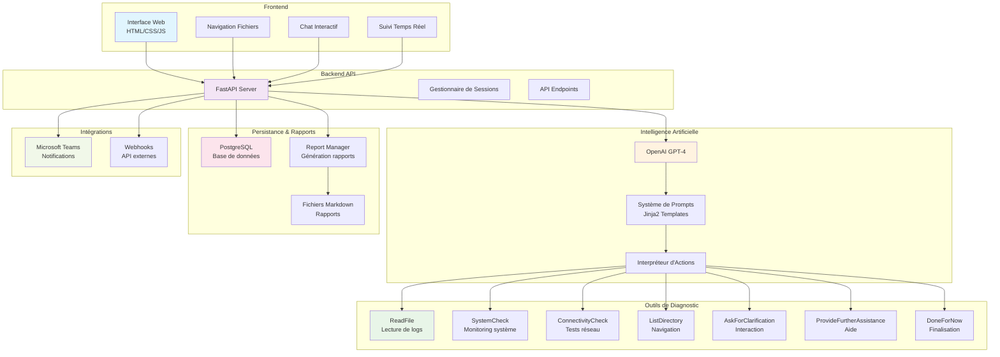
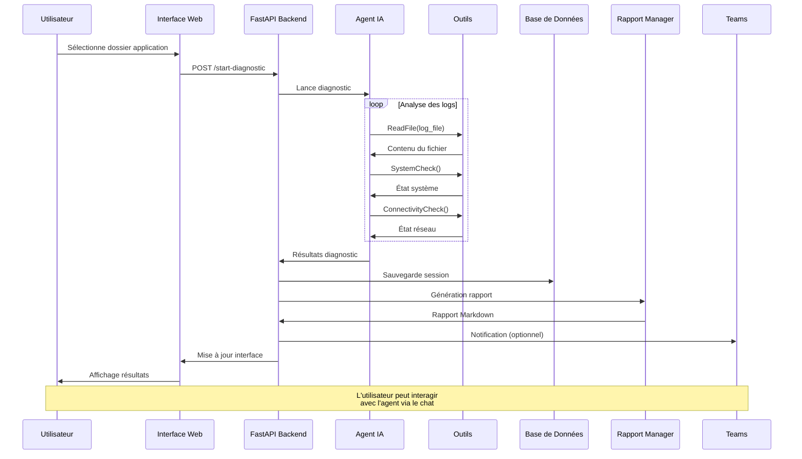
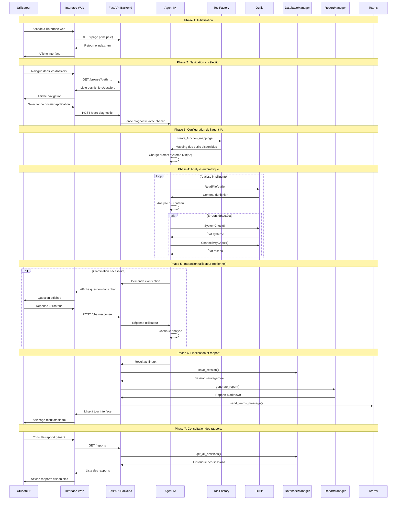
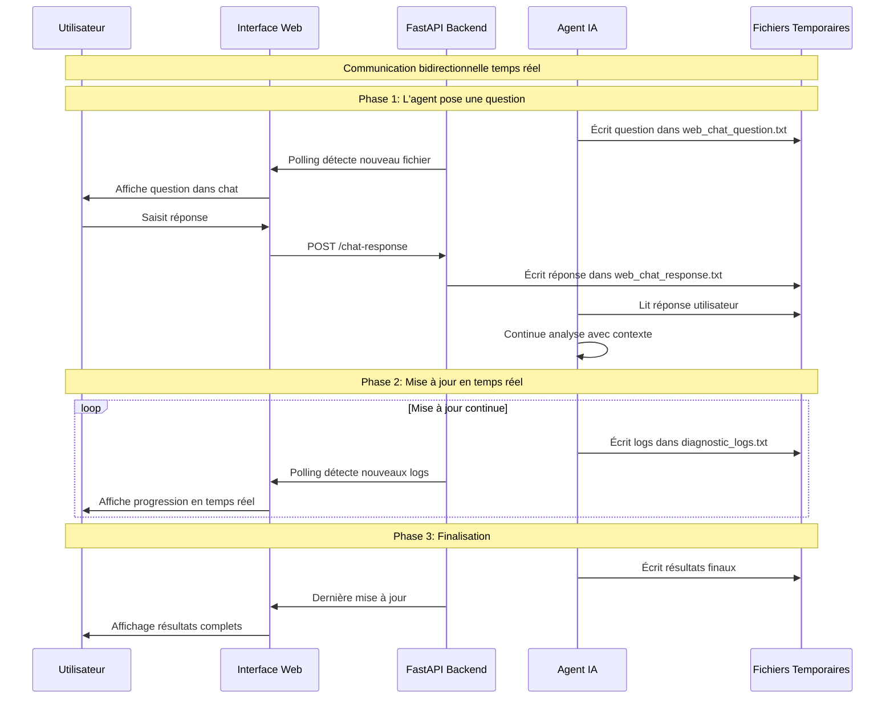
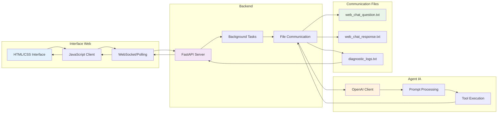
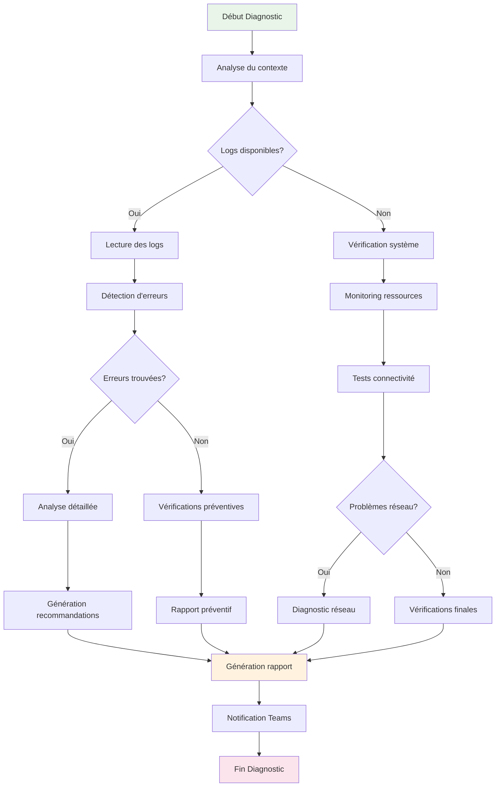
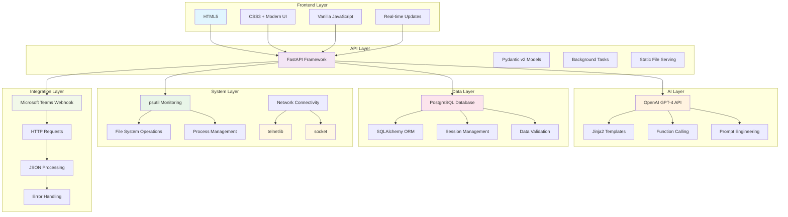

# Diagrammes Mermaid pour la Présentation

## 1. Architecture Globale du Système (Annexe 1)



## 2. Flux de Travail du Diagnostic



## 2.1. Diagramme de Séquence Détaillé - Processus Complet (annexe 2)



## 2.2. Diagramme de Séquence - Communication Temps Réel (annexe 3)



## 3. Flux de Communication Web



## 5. Structure de la Base de Données

```mermaid
erDiagram
    TROUBLESHOOTING_SESSION {
        string id PK
        string app_name
        datetime started_at
        text diagnostic_message
        json final_response
    }
    
    Note over TROUBLESHOOTING_SESSION: Structure simple et efficace
    Note over TROUBLESHOOTING_SESSION: Stockage JSON pour flexibilité
    Note over TROUBLESHOOTING_SESSION: Traçabilité complète des sessions
```

## 6. Processus de Diagnostic Intelligent



## 7. Stack Technologique Détaillé


