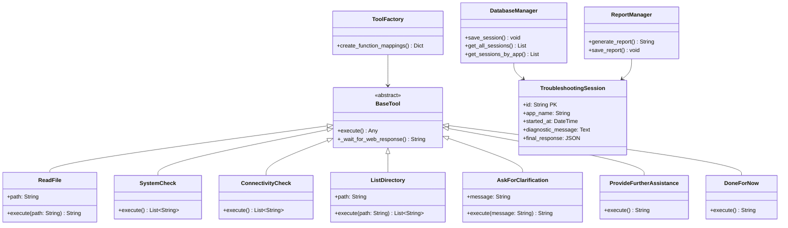

# Plan de Présentation - Troubleshooting Agent Tetra
## Présentation pour Superviseur (17 slides)

---

## Slide 1: Page de Titre
**Titre:** Troubleshooting Agent Tetra - Agent Intelligent de Diagnostic
**Sous-titre:** Automatisation du troubleshooting d'applications web avec IA générative
**Auteur:** [Votre nom]
**Date:** [Date actuelle]

---

## Slide 2: Problématique & Contexte
**Problématique:**
- Diagnostic manuel des problèmes d'applications web = temps perdu
- Analyse de logs complexe et chronophage
- Manque de standardisation dans le troubleshooting
- Réactivité limitée en cas d'incidents

**Contexte:**
- Applications web critiques nécessitant une disponibilité 24/7
- Équipes DevOps surchargées par les tâches de diagnostic
- Besoin d'automatisation et d'intelligence artificielle

---

## Slide 3: Solution Proposée
**Troubleshooting Agent Tetra:**
- Agent IA intelligent pour diagnostic automatique
- Interface web moderne et intuitive
- Analyse automatique des logs d'applications
- Génération de rapports détaillés
- Intégration avec Microsoft Teams pour alertes

**Objectifs:**
- Réduire le temps de diagnostic de 80%
- Standardiser le processus de troubleshooting
- Améliorer la réactivité en cas d'incidents
- Faciliter le travail des équipes DevOps

---

## Slide 4: Fonctionnalités Principales
**Fonctionnalités clés:**

1. **Analyse automatique des logs**
   - Lecture intelligente des fichiers de logs
   - Détection automatique des erreurs
   - Interprétation contextuelle

2. **Vérifications système**
   - Monitoring CPU, mémoire, disque
   - Tests de connectivité réseau
   - État des services

3. **Interface web interactive**
   - Navigation de fichiers
   - Chat en temps réel avec l'agent
   - Suivi en direct des diagnostics

4. **Génération de rapports**
   - Rapports détaillés en Markdown
   - Historique des sessions
   - Recommandations de résolution

---

## Slide 5: Technologies Utilisées
**Stack technologique:**


**Avantages:**
- FastAPI: Performance et modernité
- Pydantic v2: Validation robuste des données
- OpenAI GPT-4: Intelligence avancée
- PostgreSQL: Persistance fiable

---

## Slide 6: Architecture du Système
**Architecture en couches:**


---

## Slide 7: Architecture Technique Détaillée
**Diagramme de Classes:**



**Points techniques à souligner:**
- Architecture orientée objet avec classes abstraites
- Pattern Factory pour la gestion des outils
- Séparation claire des responsabilités
- Extensibilité du système

---

## Slide 8: Flux de Travail du Diagnostic
**Diagramme de Séquence:**


**Points clés du processus:**
- 5 étapes principales du diagnostic
- Communication temps réel
- Interaction utilisateur optionnelle
- Génération automatique de rapports

---

## Slide 9: Plan de Base de Données
**Structure de la Base de Données:**

```mermaid
erDiagram
    TROUBLESHOOTING_SESSION {
        string id PK
        string app_name
        datetime started_at
        text diagnostic_message
        json final_response
    }
    
    Note over TROUBLESHOOTING_SESSION: Structure simple et efficace
    Note over TROUBLESHOOTING_SESSION: Stockage JSON pour flexibilité
    Note over TROUBLESHOOTING_SESSION: Traçabilité complète des sessions
```

**Points techniques à souligner:**
- Modèle de données simple et efficace
- Stockage JSON pour la flexibilité
- Traçabilité complète des sessions
- Performance optimisée

---

## Slide 10: Résultats Obtenus
**Résultats obtenus:**

- ✅ **Interface web fonctionnelle** avec navigation de fichiers
- ✅ **Agent IA opérationnel** avec 7 outils de diagnostic
- ✅ **Base de données PostgreSQL** pour la persistance
- ✅ **Génération automatique de rapports** en Markdown
- ✅ **Intégration Teams** pour les notifications
- ✅ **Système de chat interactif** en temps réel

**Métriques fonctionnelles:**
- 7 outils de diagnostic spécialisés (ReadFile, SystemCheck, ConnectivityCheck, etc.)
- 3 types de problèmes détectés (logs, système, réseau)
- Génération de rapports en temps réel
- Communication bidirectionnelle avec l'agent IA

**Métriques techniques:**
- Architecture modulaire avec 5 composants principaux
- Base de données PostgreSQL avec 1 table optimisée
- Interface web responsive avec navigation de fichiers
- Intégration Teams fonctionnelle pour les alertes

---

## Slide 11: Difficultés Rencontrées & Solutions
**Difficulté 1: Gestion des prompts dynamiques**
- **Problème:** Adaptation du comportement de l'IA selon le contexte
- **Solution:** Système de templates Jinja2 avec chargement dynamique des capacités

**Difficulté 2: Optimisation et minimisation du prompt système**
- **Problème:** Équilibre entre précision du diagnostic et longueur du prompt
- **Solution:** Prompt engineering minimal, tenant en compte l'autonomie de l'agent

**Difficulté 3: Interface web temps réel**
- **Problème:** Synchronisation entre l'agent IA et l'interface utilisateur
- **Solution:** Système de fichiers temporaires et polling pour la communication

**Difficulté 4: Validation des données**
- **Problème:** Gestion des types de données complexes avec Pydantic
- **Solution:** Classes de base abstraites et configuration flexible

**Difficulté 5: Intégration des outils**
- **Problème:** Architecture modulaire des outils de diagnostic
- **Solution:** Pattern Factory avec mapping dynamique des fonctions

---

## Slide 12: Ouvertures & Perspectives
**Évolutions futures:**

1. **Intégrations avancées**
   - Kubernetes/Docker monitoring
   - Intégration avec des outils de monitoring (Prometheus, Grafana)
   - Webhooks pour d'autres plateformes

2. **Améliorations IA**
   - Apprentissage sur les sessions précédentes
   - Prédiction proactive des problèmes
   - Recommandations personnalisées

3. **Fonctionnalités avancées**
   - Dashboard de métriques
   - API REST complète
   - Support multi-utilisateurs
   - Historique et analytics

4. **Déploiement**
   - Containerisation Docker
   - Orchestration Kubernetes
   - CI/CD pipeline

**Impact attendu:**
- Réduction significative du temps de résolution d'incidents
- Amélioration de la satisfaction utilisateur
- Standardisation des processus de troubleshooting
- Gain de productivité pour les équipes DevOps

---

## Slide 13: Annexes
**Annexes disponibles:**

- **Annexe 1:** Architecture Globale du Système
- **Annexe 2:** Diagramme de Séquence Détaillé - Processus Complet
- **Annexe 3:** Diagramme de Séquence - Communication Temps Réel
- **Annexe 4:** Stack Technologique Détaillé

**Ces annexes contiennent:**
- Diagrammes techniques détaillés
- Flux de communication complexes
- Architecture système complète
- Stack technologique approfondi

---

## Slide 14: Annexe 1 - Architecture Globale du Système
**Voir fichier `presentation_diagrams.md` - Section 1**

---

## Slide 15: Annexe 2 - Diagramme de Séquence Détaillé
**Voir fichier `presentation_diagrams.md` - Section 2.1**

---

## Slide 16: Annexe 3 - Communication Temps Réel
**Voir fichier `presentation_diagrams.md` - Section 2.2**

---

## Slide 17: Annexe 4 - Stack Technologique Détaillé
**Voir fichier `presentation_diagrams.md` - Section 7**

---

## Notes pour la présentation orale:

**Durée estimée:** 20-25 minutes
**Temps par slide:** 1-2 minutes

**Points clés à souligner:**
- Innovation technologique avec l'IA générative
- Approche pratique et opérationnelle
- Résolution de problèmes techniques complexes
- Vision d'avenir et évolutivité

**Questions anticipées:**
- Sécurité des données et API keys
- Coût d'utilisation d'OpenAI
- Scalabilité de la solution
- Maintenance et support

**Call-to-action:**
- Démonstration en direct
- Questions et discussion
- Prochaines étapes de développement
